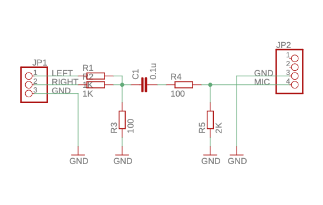
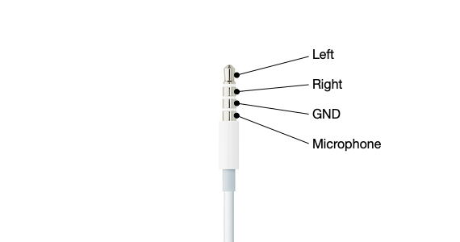

Echo Cable
==========

To input headphone audio to the microphone, it requires a special cable with a few resistors and capacitors.

There are no such commercial products that we can buy on Amazon so far, it is required to make such cable by hand.

You may also use [Lightning to 3.5 mm Headphone Jack Adapter](https://www.apple.com/shop/product/MMX62AM/A/lightning-to-35-mm-headphone-jack-adapter) or [USB-C to 3.5 mm Headphone Jack Adapter](https://www.apple.com/shop/product/MU7E2AM/A/usb-c-to-35-mm-headphone-jack-adapter), depends on your iOS device.

Schematic
---------

Here is a schematic of the curcuit of the cable.

- `JP1` is for input from 3.5mm audio headphone jack.
- `JP2` is for output to 3.5mm audio headphone jack with microphone input. See following section about the details.
- `R1`, `R2` and `R3` are to reduce headphone level about -20dB.
- `C1` cuts direct current.
- `R5` is to let iOS devices recognize there is a microphone connected.

You can omit `R1`, `R2`, `R3`, `R4` if you want to make it simple, however, `C1` and `R5` are required at minimum.

This diagram is based on [Audio Loopback Dongle](https://source.android.com/devices/audio/latency/loopback).

iOS device 3.5mm headphone jack
-------------------------------

All iOS devices uses 4 pins 3.5mm Tip Ring Ring Shield (TRRS) headphone jack that comes with left, right audio output with a monoral microhpone and control input, which is based on CTIA pinout.

That means, each pin is for left, right, GND then microhpone in this order from tip to sheild.

Assembly
--------

You can implement this curcuit inside of each end of 3.5mm audio jack header.
