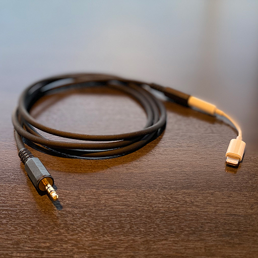
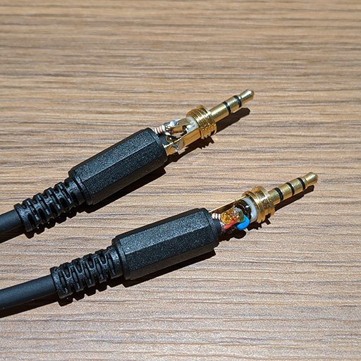

Echo Cable
==========

To input headphone audio to the microphone, it requires a special cable with a few resistors and capacitors.

There are a few such commercial products that we can buy on Amazon such as [3.5mm TRS Microphone Input Jack to TRRS Smartphone Adapter](https://www.amazon.com/-/de/dp/B01DVCA53U).

Note that there are many similar products but not working as expected. Most of the products are for output iOS device music to the speaker or headphone, which doesn’t work for this purpose, such as [3.5mm Audio Cable with Lightning Connector](https://www.apple.com/shop/product/HM792ZM/A/belkin-35mm-audio-cable-with-lightning-connector).

If you want to make it manually, refer to the following schematic.

You may also use [Lightning to 3.5 mm Headphone Jack Adapter](https://www.apple.com/shop/product/MMX62AM/A/lightning-to-35-mm-headphone-jack-adapter) or [USB-C to 3.5 mm Headphone Jack Adapter](https://www.apple.com/shop/product/MU7E2AM/A/usb-c-to-35-mm-headphone-jack-adapter), depends on your iOS device.

Schematic
---------

Here is a schematic of the circuit of the cable.

- `JP1` is for input from 3.5mm audio headphone jack.
- `JP2` is for output to 3.5mm audio headphone jack with microphone input. See the following section about the details.
- `R1`, `R2` and `R3` are to reduce headphone level about -20dB.
- `C1` cuts direct current.
- `R5` is to let iOS devices recognize there is a microphone connected.

You can omit `R1`, `R2`, `R3`, `R4` if you want to make it simple, however, `C1` and `R5` are required at a minimum.

This diagram is based on [Audio Loopback Dongle](https://source.android.com/devices/audio/latency/loopback).

iOS device 3.5mm headphone jack
-------------------------------

All iOS devices use 4 pins 3.5mm Tip Ring Ring Shield (TRRS) headphone jack that comes with left, right audio output with a monaural microphone and control input, which is based on CTIA pinout.

That means, each pin is for left, right, GND then microphone in this order from tip to shield.

Implementation
--------------

You can implement this circuit inside of each end of the 3.5mm audio jack header.

