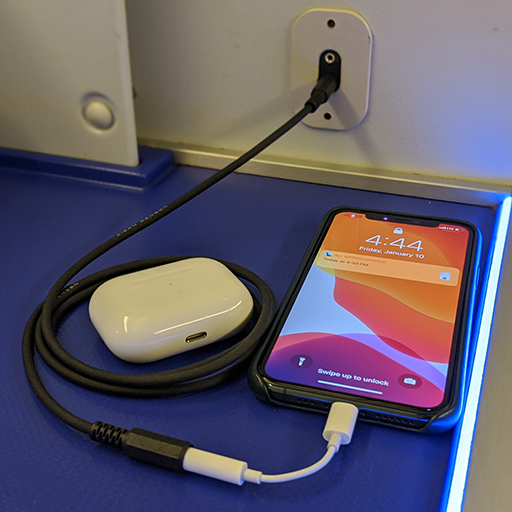
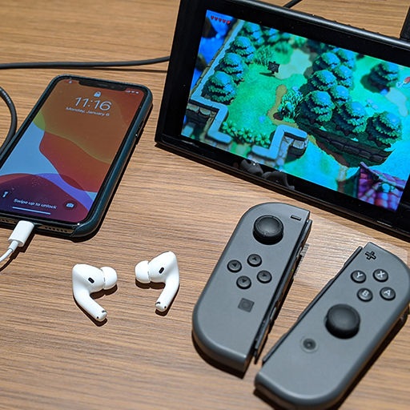

Echo
====

A simple iOS application that redirects microphone input to the Bluetooth
audio device such as AirPods so that we can use AirPods always not just only for musics on iPhone, but also for the in-flight entertainment or Nintendo Switch.

In another words, basically this makes iPhone as a Bluetooth emitter.

Usage
-----

It requires the latet iOS and Xcode. Build the app and install it to your iOS device.

You may need to switch audio output route to AirPods by using Control Center.

### Cable specification

To audio input, you need to buy a specific cable or implement it manually that connects the headphone audio to the microphone.

See the [cable documentation](Cable/README.md) for the details.
